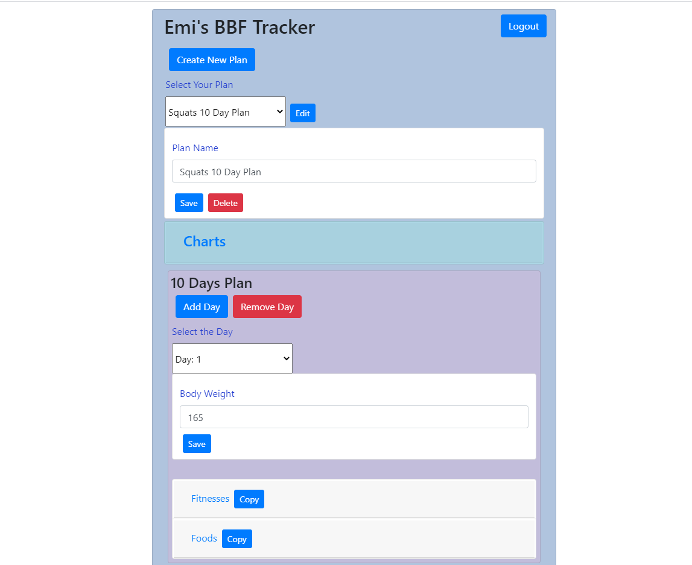
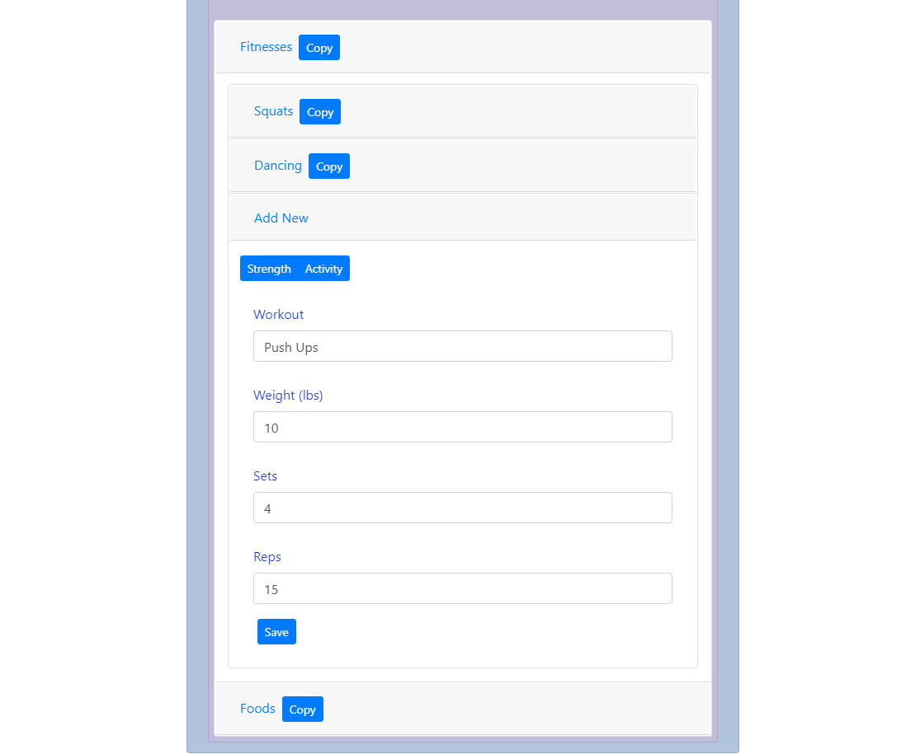
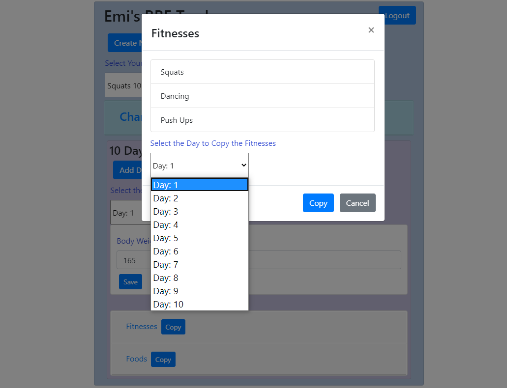
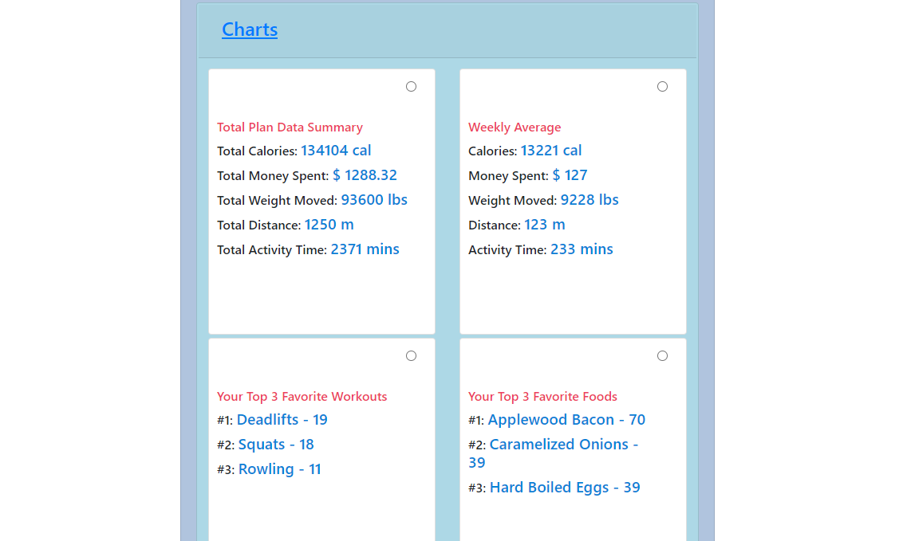
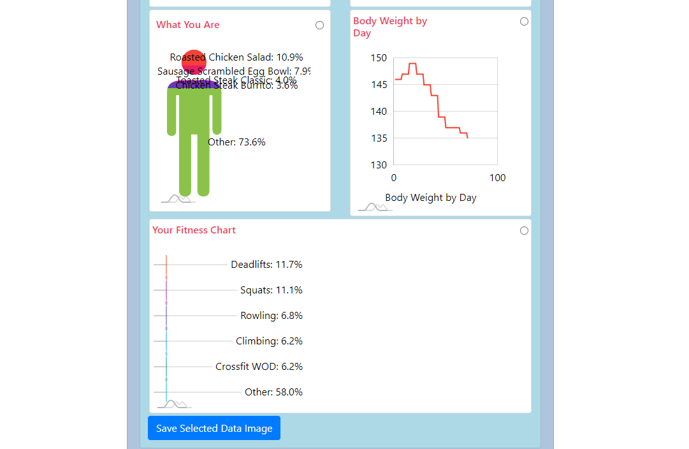

# BBF (Body By Framework) - Back-End

### Table of Contents
* General Info
* Link
* Technologies

### General Info
A platform for fitness content creators to create more content for their instagram. We take their fitness data and put it into interesting and creative perspective to increase post engagement.

### Link
[Click here to use BBF](https://bodybyframework.com/)
[Front-End GitHub](https://github.com/CaptWart/BodyByFramework)

### Technologies
Project is created with:
* JavaScript
* React JS
* Passport
* JWT
* MongoDB
* Mongoose
* Nodemailer
* NodeJs/Express
* HTML 5
* CSS 3
* react-bootstrap
* amChart
* dom-to-image
* file-saver

Deployed Front/Backend using AWS